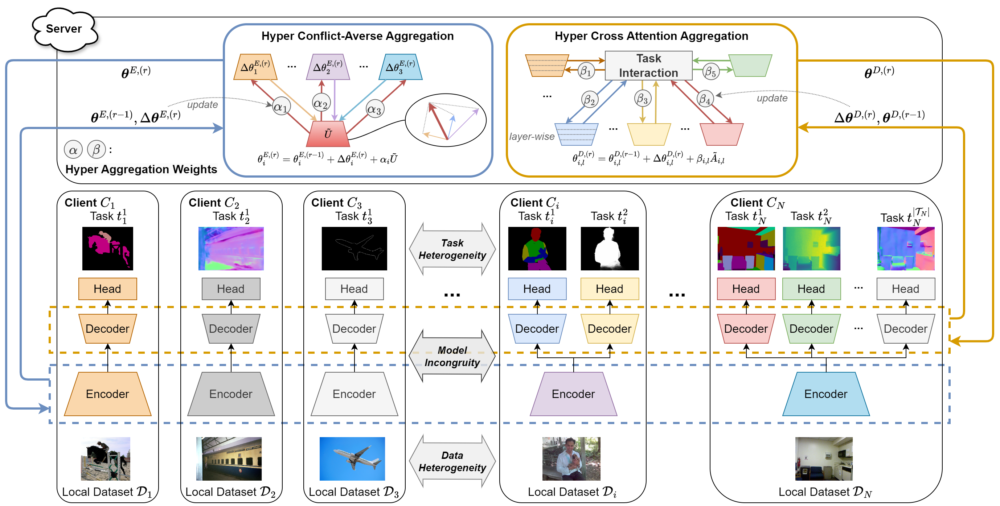

<p align="center">
  <h1 align="center">FedHCA<sup>2</sup>: Towards Hetero-Client Federated Multi-Task Learning</h1>
  <p align="center">
    <strong><a href="https://innovator-zero.github.io/">Yuxiang Lu</a><sup>*</sup></strong>
    &nbsp;&nbsp;
    <strong><a href="https://jeandiable.github.io/">Suizhi Huang</a><sup>*</sup></strong>
    &nbsp;&nbsp;
    <strong>Yuwen Yang</strong>
    &nbsp;&nbsp;
    <strong>Shalayiding Sirejiding</strong>
    &nbsp;&nbsp;
    <strong>Yue Ding</strong>
    &nbsp;&nbsp;
    <strong>Hongtao Lu</strong>
  </p>

  <p align="center">
    <a href="https://arxiv.org/abs/2311.13250"></a>
  </p>
</p>



---

## Abstract

Federated Learning (FL) enables joint training across distributed clients using their local data privately. Federated Multi-Task Learning (FMTL) builds on FL to handle multiple tasks, assuming model congruity that identical model architecture is deployed in each client. To relax this assumption and thus extend real-world applicability, we introduce a novel problem setting, Hetero-Client Federated Multi-Task Learning (HC-FMTL), to accommodate diverse task setups. The main challenge of HC-FMTL is the model incongruity issue that invalidates conventional aggregation methods. It also escalates the difficulties in model aggregation to deal with data and task heterogeneity inherent in FMTL. To address these challenges, we propose the FedHCA$^2$ framework, which allows for federated training of personalized models by modeling relationships among heterogeneous clients. Drawing on our theoretical insights into the difference between multi-task and federated optimization, we propose the Hyper Conflict-Averse Aggregation scheme to mitigate conflicts during encoder updates. Additionally, inspired by task interaction in MTL, the Hyper Cross Attention Aggregation scheme uses layer-wise cross attention to enhance decoder interactions while alleviating model incongruity. Moreover, we employ learnable Hyper Aggregation Weights for each client to customize personalized parameter updates. Extensive experiments demonstrate the superior performance of FedHCA$^2$ in various HC-FMTL scenarios compared to representative methods. 

## Cite

```
@ARTICLE{fedhca2,
  title={FedHCA$^2$: Towards Hetero-Client Federated Multi-Task Learning},
  author={Lu, Yuxiang and Huang, Suizhi and Yang, Yuwen and Sirejiding, Shalayiding and Ding, Yue and Lu, Hongtao},
  booktitle={Proceedings of the IEEE conference on computer vision and pattern recognition},
  year={2024},
}
```

## Setup

### Requirements
The following environment has been tested and recommended, you can use either pypi or conda to create it:
```
python==3.10
pytorch==2.1.2 torchvision==0.16.2
opencv-python==4.9.0.80
scikit-image==0.22.0
timm==0.9.12
tqdm==4.66.1
pyyaml==6.0.1
wandb==0.16.2 (if used)
```

### Datasets
The two datasets PASCAL-Context and NYUD-v2 can be downloaded from the links: [PASCAL-Context](https://drive.google.com/file/d/1TWZydr5_r4hKDM5Zyzrcq712Stg2cw7p/view?usp=drive_link), [NYUD-v2](https://drive.google.com/file/d/1rj3tHdQVYqe-Y3mpxv4EgWsiqgq3z87H/view?usp=drive_link).

You should extract the two datasets to the same directory, and specify the path to the directory as `db_root` variable in `datasets/utils/mypath.py`.

## Usage

### Train 
The config files of our experiments are defined in `configs/`, you can modify the HC-FMTL settings and hyperparameters such as batch size and model architecture.

To train the models, you can run the following command:
```
torchrun --nproc_per_node=2 train.py --config_path $PATH_TO_CONFIG_FILE --exp $EXP_NAME --results_dir $RESULTS_DIR
```
`$PATH_TO_CONFIG_FILE` is the path to the config file, and `$EXP_NAME` is the name of the experiment. The config file and checkpoints will be saved in `$RESULTS_DIR/$EXP_NAME`. There are some options you can specify in the command line, such as `--seed $SEED` to set a seed, `--wandb_name $WANDB_NAME` to log with [wandb](https://wandb.ai/site), `--fp16` to use mixed precision training, and  `--save_vram` to save the GPU memory usage in aggregation and Hyperweight update. The number of communication rounds can be specified by `--max_rounds $MAX_ROUNDS`, the frequency of evaluation can be specified by `--eval_freq $EVAL_FREQ`. 

Regarding aggregation schemes, you can specify the aggregation algorithm by `--encoder_agg` and `--decoder_agg` for encoders and decoders, and set hyperparameters by `--ca_c`, `--enc_alpha_init`, and `--dec_beta_init`.

### Test

To evaluation the models, you can run the following command:
```
python test.py --exp $EXP_NAME --results_dir $RESULTS_DIR --evaluate
```
`$EXP_NAME` is the name of the experiment and `$RESULTS_DIR` is the output directory specified when training. When `--evaluate` is used, the clients' models will be evaluated, and the predictions for edge will be saved. When `--save` is used, the predictions for all clients on all tasks will be saved. The predictions will be saved in `$RESULTS_DIR/$EXP_NAME/predictions`. You can specify the gpu to use by `--gpu $GPU`.

#### Edge evaluation
To evaluate the edge detection result, a evaluation tool is needed to calculate optimal-dataset-scale F-measure (odsF), which is modified from [SEISM](https://github.com/jponttuset/seism) project. Specfically, we use maxDist=0.0075 for PASCAL-Context and maxDist=0.011 for NYUD-v2, following the previous works.

You can follow the steps below:

1. The prediction images should be saved in the directory `$RESULTS_DIR/$EXP_NAME/predictions/$IDX_edge/img/` after running `test.py`.
2. The SEISM project is based on MATLAB, make sure you have MATLAB installed.
3. Clone our modified version of SEISM into `eval/` folder:
```
cd evaluation
git clone https://github.com/innovator-zero/seism.git
```
4. Modify the `seism/src/gt_wrappers/db_root_dir.m` to specify the path to the dataset.
5. Run the following command:
```
cd evaluation
python edge_evaluation.py --exp $EXP_NAME --results_dir $RESULTS_DIR --idxs $IDX1 $IDX2 --datasets $DATASET1 $DATASET2 --nms
```
`$IDX` are the indexes of client having edge detection task, `$DATASET` are corresponding dataset names, either `PASCALContext` or `NYUD`, `--nms` will firstly apply non-maximum suppression (NMS) processing to the predictions, the processed images will be saved in `$RESULTS_DIR/$EXP_NAME/predictions/$IDX_edge/nms/`.

6. Get the evaluation results by running the following command:
```
python edge_evaluation.py --exp $EXP_NAME --results_dir $RESULTS_DIR --idxs $IDX1 $IDX2 --datasets $DATASET1 $DATASET2 --done
```
You can also find detailed results in `$RESULTS_DIR/$EXP_NAME/predictions/$IDX_edge_test.txt`.

## Acknowledgement

Our implementation is based on our [MTDP_Lib](https://github.com/innovator-zero/MTDP_Lib), which is a simple code base for multi-task dense prediction methods.

We also thank following code repositories for references: [MaT-FL](https://github.com/VITA-Group/MaT-FL), [PFLlib](https://github.com/TsingZ0/PFLlib).